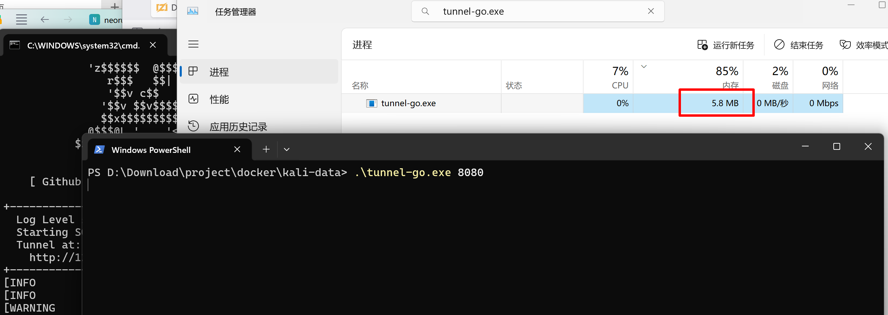
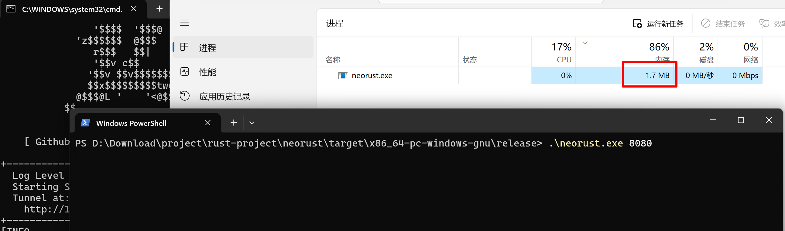

# rust 版本的
## 背景
使用[Neo-reGeorg](https://github.com/L-codes/Neo-reGeorg/tree/master)的go版本[tunnel.go](https://github.com/L-codes/Neo-reGeorg/blob/master/templates/tunnel.go)时，发现编译生成的产物体积很大，这是go语言静态编译固有的缺点。

正好最近在学习rust，因此想要实现一个rust版本的Neo-reGeorg服务端，看看rust是否真的比go强，强在哪？


## 过程
### go版本 [tunnel.go](https://github.com/L-codes/Neo-reGeorg/blob/master/templates/tunnel.go)

#### 编译命令
```bash
CGO_ENABLED=0 \
GOOS=windows \
GOARCH=amd64 \
go build -ldflags \
"-extldflags '-static' -w -s" \
-gcflags  "-l" -o tunnel1.exe tunnel.go
```
说明：
- `CGO_ENABLED`=0 禁用 CGO（移除 C 依赖）
- `GOOS`：指定目标操作系统（linux/windows/darwin 等）
- `GOARCH`：指定目标架构（arm 对应 32 位，arm64 对应 64 位）
- `GOARM`：针对 32 位 ARM 的额外版本指定（5/6/7，默认为 6）
- `-s`：移除符号表（symbol table）
- `-w`：移除调试信息（DWARF 表）
- `-extldflags '-static'` 静态链接
- `-gcflags "-l"`：禁用内联优化（配合 LTO 效果更好，具体需测试）。

### rust版本
#### rust cargo编译选项
```toml
[profile.release]
# 优化等级：z 比 s 更侧重减小体积（牺牲部分性能）
opt-level = "z"  # 或 "s"（s 平衡体积和性能，z 体积更小）
# 链接时优化（LTO）：跨模块分析并删除冗余代码，显著减小体积
lto = true       # 或 "thin"（更快的 LTO 变体，体积略大但编译更快）
# 代码生成单元：设为 1 允许更彻底的优化（但编译变慢）
codegen-units = 1
# 去除调试信息（默认 release 已有一定程度去除，显式关闭更彻底）
debug = false
panic = "abort"

```
#### 编译命令
`cargo build --release --target x86_64-pc-windows-gnu`

##### Linux 编译环境准备
注意，在linux下编译rust程序时，需要先安装`mingw`，和编译工具链`x86_64-pc-windows-gnu`
- `apt-get install gcc-mingw-w64-x86-64`
- `rustup target add x86_64-pc-windows-gnu`
- `cargo build --release --target x86_64-pc-windows-gnu`


## 产物对比
### 落地文件对比
#### go编译产物
5.47 MB (5,742,080 字节)


#### rust编译产物(740KB)
740 KB (758,262 字节)


#### 对比结果
$$x = \frac{5,742,080}{758,262} \approx 7.572$$

### 运行内存对比
因为内存有些是运行时分配的，因此以下对比均在使用代理访问一次[ziglang文档](https://ziglang.org/documentation/0.14.1/)时测量的内存。
#### go
5.8MB 


#### rust
1.7MB



#### 对比结果
$$x = \frac{5.8}{1.7} \approx 3.412$$

## 总结
总体来说，rust版本无论是从落地文件来说，还是从运行内存来说，都相对go要好很多。并且从go的 [tunnel.go](https://github.com/L-codes/Neo-reGeorg/blob/master/templates/tunnel.go) 到[src/main.rs](src/main.rs) 用AI转换很快。

然而，go语言的优势在于go代码相对来说简洁很多，也没有很多复杂的语法，这或许就是一种优势吧。