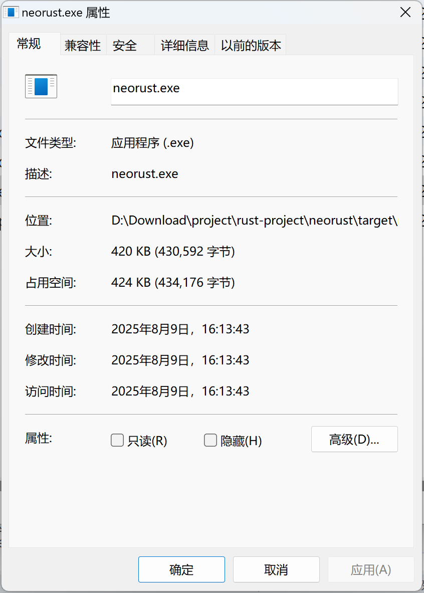
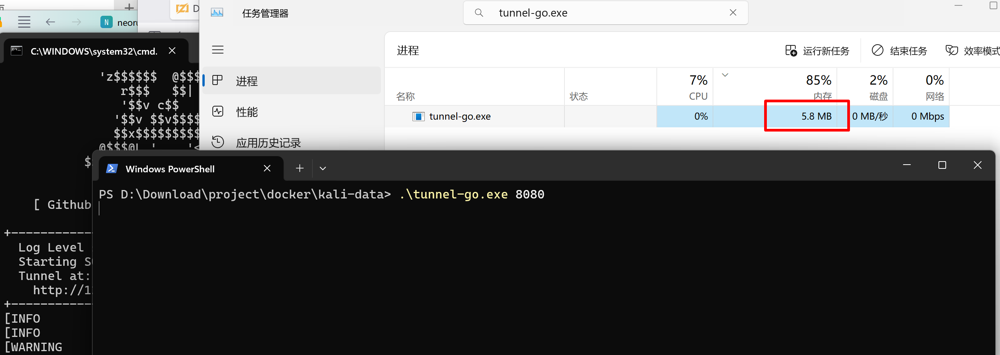
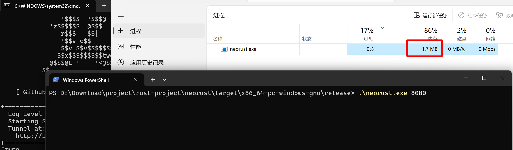

# rust 版本的Neo-reGeorg服务端

## 背景
使用[Neo-reGeorg](https://github.com/L-codes/Neo-reGeorg/tree/master)的go版本[tunnel.go](https://github.com/L-codes/Neo-reGeorg/blob/master/templates/tunnel.go)时，发现编译生成的产物体积很大。
在某些环境下，例如嵌入式设备flash和rom容量较小的情况下，容易启动失败，这是go语言静态编译固有的缺点。

正好最近在学习[rust](https://www.rust-lang.org)。
> Rust 速度惊人且内存利用率极高。由于没有运行时和垃圾回收，它能够胜任对性能要求特别高的服务，可以在嵌入式设备上运行，还能轻松和其他语言集成。 

因此想要实现一个rust版本的Neo-reGeorg服务端，解决编译体积和运行内存占用大的问题。

## 构建方法
编译已有go版本。对照go版本的源码，编写rust版本。然后编译、运行、对照。
### go版本 
直接使用[tunnel.go](https://github.com/L-codes/Neo-reGeorg/blob/master/templates/tunnel.go)中的go语言版本。
#### 编译命令
```bash
CGO_ENABLED=0 \
GOOS=windows \
GOARCH=amd64 \
go build -ldflags \
"-extldflags '-static' -w -s" \
-gcflags  "-l" -o tunnel1.exe tunnel.go
```
说明：
- `CGO_ENABLED`=0 禁用 CGO（移除 C 依赖）
- `GOOS`：指定目标操作系统（linux/windows/darwin 等）
- `GOARCH`：指定目标架构（arm 对应 32 位，arm64 对应 64 位）
- `GOARM`：针对 32 位 ARM 的额外版本指定（5/6/7，默认为 6）
- `-s`：移除符号表（symbol table）
- `-w`：移除调试信息（DWARF 表）
- `-extldflags '-static'` 静态链接
- `-gcflags "-l"`：禁用内联优化（配合 LTO 效果更好，具体需测试）。

### rust版本
通过对[tunnel.go](https://github.com/L-codes/Neo-reGeorg/blob/master/templates/tunnel.go)进行rust改造，实现的rust版本。
#### cargo编译选项
```toml
[profile.release]
# 优化等级：z 比 s 更侧重减小体积（牺牲部分性能）
opt-level = "z"  # 或 "s"（s 平衡体积和性能，z 体积更小）
# 链接时优化（LTO）：跨模块分析并删除冗余代码，显著减小体积
lto = true       # 或 "thin"（更快的 LTO 变体，体积略大但编译更快）
# 代码生成单元：设为 1 允许更彻底的优化（但编译变慢）
codegen-units = 1
# 去除调试信息（默认 release 已有一定程度去除，显式关闭更彻底）
debug = false
panic = "abort"

```
#### 编译命令
这里使用linux交叉编译windows的程序。

`cargo build --release --target x86_64-pc-windows-gnu`

##### Linux 编译环境准备
注意，在linux下编译rust程序时，需要先安装`mingw`，和编译工具链`x86_64-pc-windows-gnu`
- `apt-get install gcc-mingw-w64-x86-64`
- `rustup target add x86_64-pc-windows-gnu`
- `cargo build --release --target x86_64-pc-windows-gnu`


## 对比
### 落地文件对比
#### go编译产物
5.47 MB (5,742,080 字节)


#### rust编译产物(740KB)
420 KB (434,176 字节)



#### 对比结果
$$\frac{go}{rust}= \frac{5,742,080}{434,176} \approx 13.225$$

### 运行内存对比
因为内存有些是运行时分配的，因此不能仅仅简单对照程序启动时的内存。

以下对比均在使用代理服务端**访问一次**目标[ziglang文档](https://ziglang.org/documentation/0.14.1/)时测量的占用内存。

#### go
5.8MB 


#### rust
1.7MB



#### 对比结果
$$\frac{go}{rust}=  \frac{5.8}{1.7} \approx 3.412$$

## 使用
在neo-reGeorg官方仓库中介绍了go版本的使用方法。使用场景为“极端环境”。什么是极端环境呢？这里尝试给出一个例子。


### 使用场景
1、无法使用脚本语言
例如，路由器、IOT设备等没有Apache、tomcat等web服务器、使用lighttpd等二进制提供web服务的场景下，现有的`jsp`,`php`等均无法建立隧道。

2、无法使用ssh建立动态端口转发
例如，在一些网络环境下，无ssh或ssh动态端口转发被禁用，无法使用`-D`参数。

`1&2`场景下（例如：路由器、IOT设备等），rust版本的Neo-reGeorg服务端可以作为替代方案。


### neo-reGeorg服务端使用

#### 本地测试

本地测试时可以运行
```
cargo run -- <port>
```
参数说明：
- `<port>`：指定服务端监听的端口号（目标上）。

#### 编译运行
同样，可以使用cargo编译出可执行文件。
```
cargo build --release --target x86_64-pc-windows-gnu
```
然后，在目标上运行。
```
./target/x86_64-pc-windows-gnu/release/neorust.exe <port>
```
### 运行Neo-reGeorg客户端
在本地运行[Neo-reGeorg](https://github.com/L-codes/Neo-reGeorg/tree/master)客户端
```
uv run .\neoreg.py -k password -u http://target-ip:8080 -vvv -l 0.0.0.0 -p 1080
```
- `-k password`：指定密码为`password`
- `-u http://target-ip:8080`：指定服务端地址为`http://target-ip:8080`
- `-vvv`：指定日志级别为`vvv`，即给出调试信息
- `-l 0.0.0.0`：指定监听地址为`0.0.0.0`
- `-p 1080`：指定监听端口为`1080`（不加此参数，默认监听端口为`1080`）


## 总结
总体来说，go版本的落地文件是rust的13.225倍；从运行内存来说，go版本是rust版本的3.4倍。基本可以满足一些go版本满足不了的嵌入式环境。

另外，从go的 [tunnel.go](https://github.com/L-codes/Neo-reGeorg/blob/master/templates/tunnel.go) 到[src/main.rs](src/main.rs) 的迁移我是用AI转换，转换过程也很快。这得益于rust强类型和rustc编译器的拷打。运行无bug。
> 最近发现字节的Trae对于rust的支持很好，自动化AI编程的感觉更进一步。有一种感觉，rust虽然语法复杂，但是对于AI来说，这些强类型和约束，正好是喂给AI的确定性，使得AI能够更好的与rust交互，减轻人类用户的心智负担。
> **有种预感，rust将会是AI时代的主流AI编程语言**。

然而，go语言的优势在于：**go代码相对来说简洁很多**，也没有很多复杂的语法。在本例实现中，尤其感叹go channel的高效和简洁。